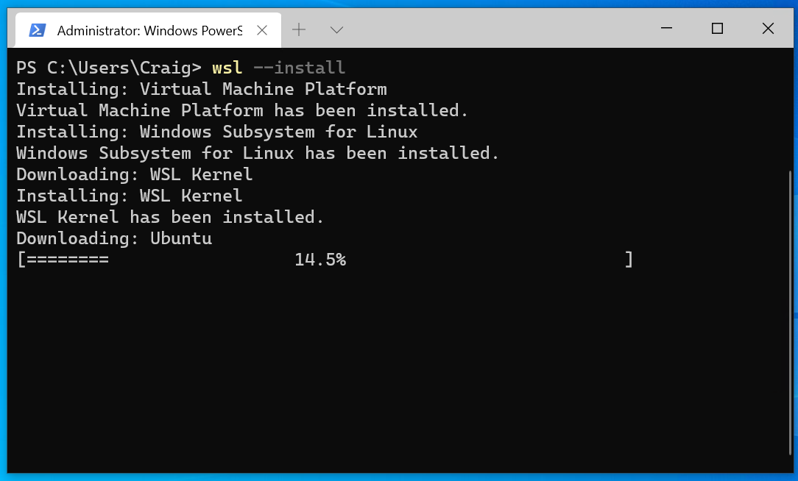
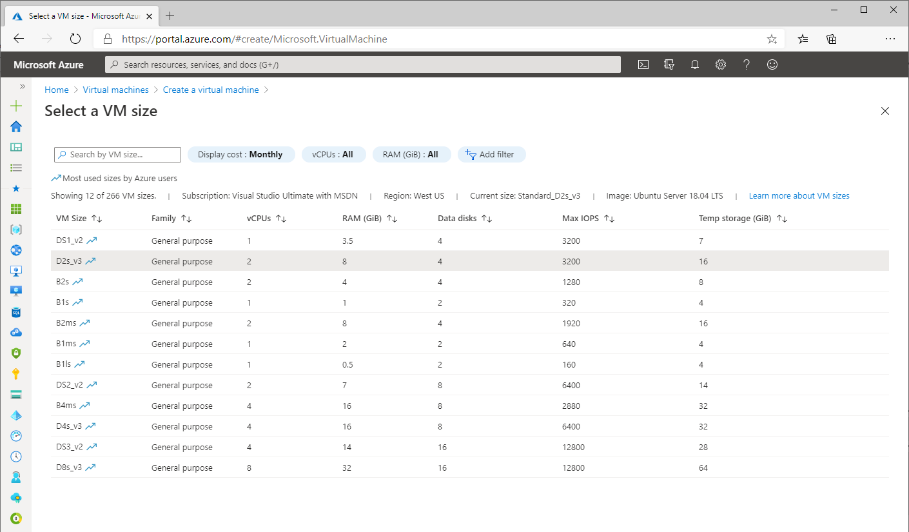
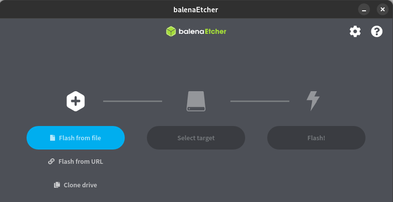
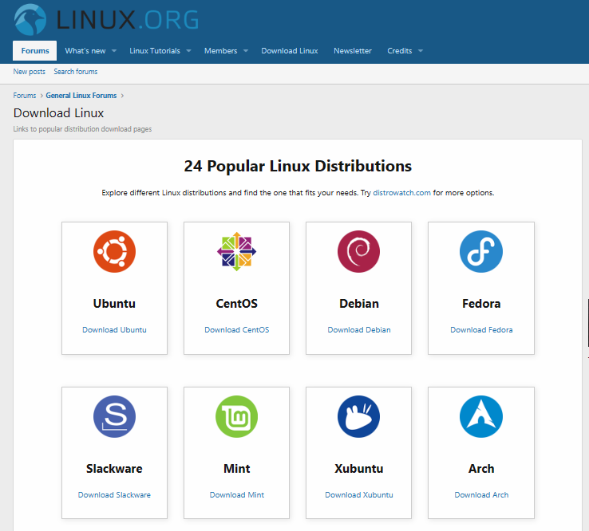
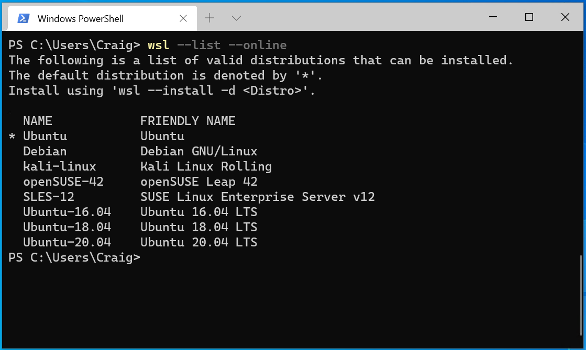
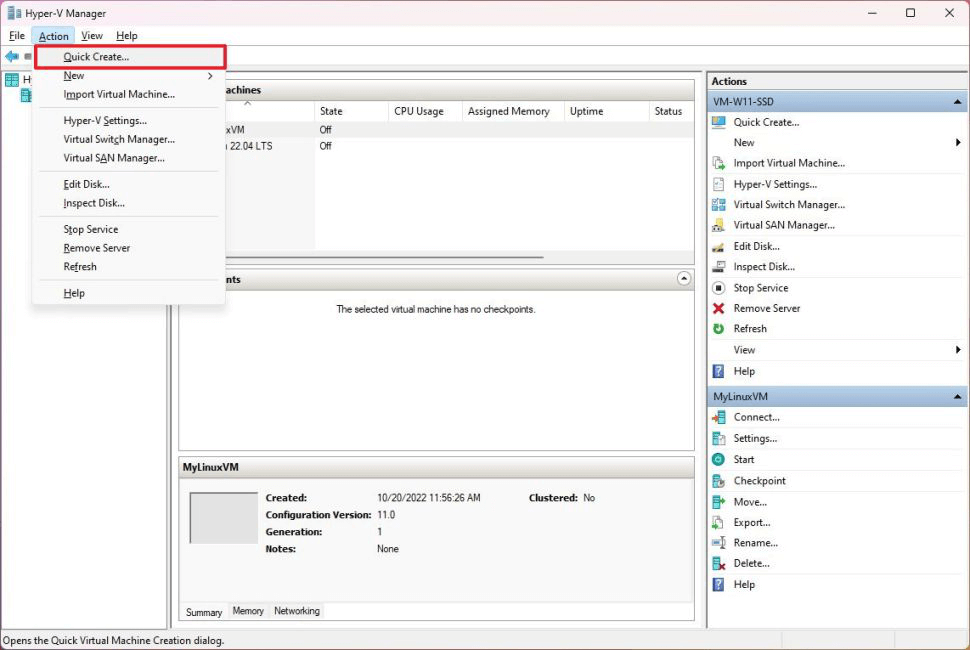
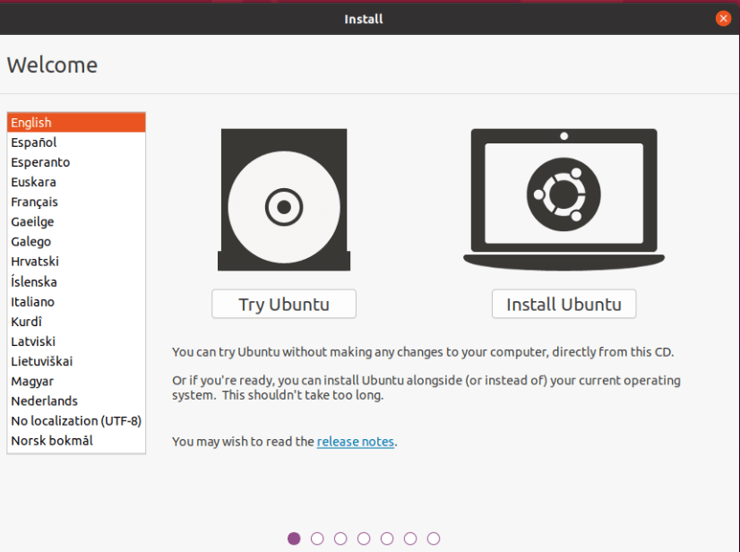

# How to download and install Linux

Linux is an operating system, similar to Windows, but with many different versions due to the nature of being open source and fully customizable. To install Linux, you must choose an install method and choose a Linux distribution.

To install Linux:

1. [Choose an install method](#step-1---choose-a-method-to-install-linux): Windows Subsystem for Linux (WSL), Bare metal Linux; or create a Virtual Machine (VM) to run Linux locally or in the cloud.

2. [Choose a Linux distribution](#step-2---choose-a-linux-distribution): Ubuntu, Debian, Kali Linux, OpenSUSE, etc.

3. [Follow the steps for your preferred install method](#step-3---follow-install-method-instructions):
    - [Use the install Linux command with Windows Subsystem for Linux (WSL)](#install-linux-with-windows-subsystem-for-linux)
    - [Create a Linux Virtual Machine (VM) in the cloud](#create-a-linux-virtual-machine-in-the-cloud)
    - [Create a Linux Virtual Machine (VM) on your local machine](#create-a-linux-virtual-machine-locally-using-a-hypervisor)
    - [Create a bootable USB to install bare-metal Linux](#create-a-bootable-usb-drive-to-install-bare-metal-linux)

4. [After installing Linux](#step-4---after-installing-linux): Get familiar with your distribution's package manager, update and upgrade the packages available, and get familiar with the other [Linux resources at Microsoft](./index.yml), such as training courses, Linux-versions of popular tools, news, and Open Source events.

## Step 1 - Choose a method to install Linux

The choice of which method to use for installing Linux depends on your needs and preferences.

- **New to using Linux?** We recommend starting with Windows Subsystem for Linux (WSL) as it's the easiest way to get up and running.
- **Work in a business environment with more complex needs related to scale or security?** We recommend running Linux as a Virtual Machine (VM) in the cloud and checking out the support that Azure has to offer. This also applies if you want to run Linux as a server.
- **Only want to run Linux as your primary operating system?** If you are good with a slightly more complicated install process and don't need access to Windows tools (like Outlook, Teams, Word, PowerPoint, etc), you can run Linux on bare metal to access the full potential of your hardware without any overhead from virtualization or emulation.

Learn more about these options below.

### Windows Subsystem for Linux (WSL)

This is the most simple install method. Just run the Linux install command: `wsl --install` to install the Ubuntu distribution.

This method uses virtualization to integrate the Windows operating system (OS) with the Linux OS (running on an actual Linux kernel). You can add as many different Linux distributions as you please and run your favorite Linux tools, including GUI apps, alongside your favorite Windows tools. You can also mix and match Bash and PowerShell commands in the same command line. A Linux file system hosts your project files, while a separate Windows file systems hosts any developer tools, such as VS Code, that you'd like to work on the files with. This method of running Linux is highly efficient and performant. Once you choose a Linux distribution or opt to use the default Ubuntu distro, follow the instructions to [Use the install Linux command with Windows Subsystem for Linux](#install-linux-with-windows-subsystem-for-linux) or learn more in the [WSL documentation](/windows/wsl).



### Create a Virtual Machine (VM)

A VM is a digital version of a physical computer and is a popular option for running Linux in environments that may require you to scale the level of hardware support (Memory and processing power required) and the level of Security (antimalware, encryption, backups, policy management, etc).

Like with WSL, you can create VM instances of as many different Linux distributions as you'd like, running them in an isolated environment, free from any conflicts and great for software development testing. While running a Linux distribution on WSL has slightly faster performance, a Linux VM is easier to clone or migrate. You can create a virtual machine on a cloud service like Azure or on your local machine, using a hypervisor.

Creating a VM on Azure means that it's hosted in the cloud, on Microsoft's servers. You are essentially renting computing resources from Microsoft and using them to run the VM. This can be convenient if you need to quickly provision a new VM or need to run a workload that requires more computing resources than your local computer can provide. Larger businesses with more complex needs often choose to run Linux VMs on Azure for its scalability, control and abundance of features. Learn more about the architecture, workflow, and considerations to [Run a Linux VM on Azure](/azure/architecture/reference-architectures/n-tier/linux-vm).

Creating a VM on your local machine requires virtualization using a hypervisor. Windows includes a "type 1" hypervisor called [Hyper-V](/virtualization/hyper-v-on-windows/) to run virtualization directly on your device hardware.There are also "type 2" hypervisors that run on top of the operating system, like VirtualBox or VMware. You are responsible for managing the virtual machine, including allocating resources like memory and disk space, and ensuring that it is secure and up-to-date. This requires more technical expertise than some of the other options and may not be as scalable or fault-tolerant.

Once you've chosen a distribution and decided whether you want to run the VM locally, using a hypervisor, or in the cloud, using Azure, follow the instructions to [Create a Linux Virtual Machine in the Cloud](#create-a-linux-virtual-machine-in-the-cloud) or [Create a Linux Virtual Machine locally using a Hypervisor](#create-a-linux-virtual-machine-locally-using-a-hypervisor)



### Bare metal Linux

Bare metal Linux just means that Linux is running directly on the device hardware. This install method requires you to create a bootable USB drive by downloading an iso install file from the site hosting your chosen Linux distribution. You will need to use a Windows computer (or any desktop device with an existing OS) to create this drive.

Many users choose the traditional method of installing bare metal Linux on a device that is also running Windows and using the **"dual boot"** method. To dual boot Linux and Windows, you need to partition your hard drive to create separate spaces for both the Linux and Windows OS. The performance speed between WSL, virtual machines, and bare metal Linux has become so close that few developers choose this method due to the overhead of needing to restart (reboot) your device any time you want to switch between the operating systems. If you choose the bare metal Linux install route, you may also need to deal with potential driver issues or hardware compatibility problems that may arise with Linux on some devices.

You can find a list of [Popular Linux Distributions available for download on Linux.org](https://linux.org/pages/download/). Once you've chosen a distro, follow the instructions to [Create a bootable USB to install bare-metal Linux](#create-a-bootable-usb-drive-to-install-bare-metal-linux).



## Step 2 - Choose a Linux distribution

The different versions of Linux are called "distributions" (sometimes shortened to “distros”). So there isn’t actually a way to just “install Linux”, you first need to choose which distribution that uses the Linux kernel you want to download and install. There are over 600 active Linux distributions, such as Ubuntu, Debian, Kali Linux, OpenSUSE, and more. There are a number of factors to consider in choosing a distribution, such as:

### Required Linux experience

If you’re new to Linux, you may want to start with Ubuntu. This is one of the most common starting places for Linux users due to the level of support and ease of use. Ubuntu offers a desktop-version and a server-version depending on how you plan to use it. The specific tasks that the operating system will be responsible for may help you determine which distribution to use. Arch Linux is a popular choice for those who want a highly customizable, do-it-yourself approach that is still stable and well-supported by a large user base. It is a much more complicated place to start, but can help you to get a better understanding of how Linux works due to the amount of custom configuration.

### System requirements

A minimal, or "lightweight", distribution means a small footprint, with lower memory and processing speed requirements. Alpine Linux is a popular option where users will find most features disabled or not installed by default, but still has everything you need for a containerized app.
Security needs: Some Linux users may have specific security concerns to consider. Kali Linux is an example of a distro designed for security tasks, such as Penetration Testing, Security Research, Computer Forensics and Reverse Engineering.

### Business and Enterprise requirements

Business, corporate, or academic environments may have unique concerns from consumer environments. Both Red Hat Enterprise Linux (RHEL) and Oracle Linux offer 24/7 global support and subscription-based service. CentOS is another popular enterprise distro that is community-supported but still compatible with RHEL.

### Community support

A large user community that consistently contributes to the distribution, fixing bugs, adding features, helping with questions, etc. is another good consideration. Ubuntu is one of the most popular distos. OpenSUSE has been around longer than most other distributions and still receives active updates. Many other distros rapidly grow popular as the needs and preferences of the user community change. The Linux.org site has resources to help you assess what's available, well-supported, or growing in popularity.



## Step 3 - Follow install method instructions

### Install Linux with Windows Subsystem for Linux

To install Linux on a Windows PC, use the install Linux command.

1. Open PowerShell or Windows Command Prompt in *administrator mode* by right-clicking and selecting "Run as administrator".
2. Enter the Linux install command: `wsl --install`.
3. Restart your machine.



#### Install Linux command options

By default, the install command will use the Ubuntu distribution of Linux. You can see the other distributions that are available in the Microsoft Store by entering the command: `wsl -l -o`. If you'd like to install a distribution other than Ubuntu, just add `-d` to the command with the name of the distribution you'd like to install:

```powershell
wsl --install -d <Distro Name>
```

If the distribution you want to install isn't available in the Microsoft Store, see the Windows Subsystem for Linux (WSL) documentation on how to [Important any Linux distribution to use with WSL](/windows/wsl/use-custom-distro).

For more information on how to use VS Code, Git, databases, Docker, GUI apps, GPU acceleration, NodesJS, USB devices, or mount a disk, build a custom distribution, manage disk space, or set up WSL for your enterprise business, see the [WSL documentation](/windows/wsl/).

### Create a Linux Virtual Machine in the cloud

To create a Linux Virtual Machine (VM) that is hosted in the cloud on Azure, log-in to the Azure Portal and select the “Create a Virtual Machine” service. Then follow the instructions for creating a user name, project, instance, SSH key, ports, and copying the IP address.

Azure supports a variety of options for setting up Linux VMs in the cloud. For a quickstart guide on how to set up a Linux VM, choose your preferred method:

- [Azure Portal](/azure/virtual-machines/linux/quick-create-portal?tabs=ubuntu&source=docs)
- [Azure CLI](/azure/virtual-machines/linux/quick-create-cli)
- [Azure PowerShell](/azure/virtual-machines/linux/quick-create-powershell)
- [Terraform](/azure/virtual-machines/linux/quick-create-terraform)
- [A Bicep file](/azure/virtual-machines/linux/quick-create-bicep?tabs=CLI) 
- [Azure Resource Manager (ARM) template](/azure/virtual-machines/linux/quick-create-template)

If you don't have an Azure subscription, [create a free account](https://azure.microsoft.com/free/) before you begin. If you're new to creating Linux VMs with Azure, you can [learn more about VMs](https://azure.microsoft.com/resources/cloud-computing-dictionary/what-is-a-virtual-machine) or check out the online training course: [Create a Linux virtual machine in Azure](/training/modules/create-linux-virtual-machine-in-azure/).


### Create a Linux Virtual Machine locally using a hypervisor

To create a Linux VM that is hosted on your local machine using a hypervisor, you can use:

- [Windows Hyper-V](/virtualization/hyper-v-on-windows/)
- [VirtualBox](https://www.virtualbox.org/)
- [VMware](https://docs.vmware.com/en/VMware-Horizon-7/7.13/linux-desktops-setup/GUID-51C371A9-4D76-4A8C-8645-909E93080B4F.html)

You will need to check the hardware requirements for your chosen hypervisor. Once the hypervisor is enabled or installed, you will need to choose the type of OS that you want to install and the installation source (this is typically a .iso or .vhdx file). You will need to give the VM a name, select the directory where files will be hosted, select the amount of memory to allocate to the VM and the size of the virtual hard drive where files will be stored (you can typically choose between a fixed or dynamically allocated amount of drive space). Sometimes integrations with a Linux virtual machine can be tricky due to display drivers and other hardware dependencies, but most hypervisors have an active user community that can help. You may also need to set up a virtual network if you want your VM to connect to the internet.

If you're new to hypervisors and want to learn more, try the free online training module: [Configure and manage Hyper-V virtual machines](/training/modules/configure-manage-hyper-v-virtual-machines/).



### Create a bootable USB drive to install bare-metal Linux

If you want bare-metal Linux, whether to run a distribution alone on a device or to dual-boot between the distribution and Windows, here are the steps:

1. Download an image file for your chosen Linux distribution.
    This is usually an ISO file. As an example, you can find an image file for the most recent version of Ubuntu at [Download Ubuntu Desktop](https://ubuntu.com/download/desktop). Some Linux distributions may require you to verify the image signature before downloading.
2. Create a bootable USB drive.
    You will typically need a USB drive with at least 16gb of space. You will also need software to create the bootable drive. There are many options (such as balenaEtcher, Rufus, UNetbootin, etc.). Often the download site for your chosen Linux distribution will recommend which startup disk creater software to use.
3. Boot your device from the USB drive.
    When restarting the device, you will need to enter the boot menu. This is typically done by holding down the F12 key during startup. You can then select the USB drive containing your Linux distribution ISO to install from.
4. Select install options.
    Typically the installer for your Linux distribution will include a set of installation steps that will involve choosing options about whether you want to include certain features, third-party software packages, etc. You may also need to specify whether to erase the disk in the case that this Linux distro will be the only operating system, or to use a partition, if you plan to run multiple operating systems. You may also be asked about whether you'd like to enable encryption.
5. Finally, as with any Linux installation, you will be asked to create a user name and password.



## Step 4 - After installing Linux

Once you have successfully installed a Linux distribution, there are a few more important steps:

1. Get familiar with the preferred package manager used by your chosen Linux distribution. Linux uses package manager's to download and update any software that you plan to use. For example, Ubuntu uses the [Advanced Packaging Tool (APT)](https://ubuntu.com/server/docs/package-management).
2. Use your distribution's package manager to update and upgrade your distribution. Software packages in a stable release of a Linux distribution are often outdated. It is recommended to regularly run an update. You may also want to run an upgrade, which installs newer versions of any packages that you've already installed. For example, if you're using Ubuntu, run: `sudo apt update && sudo apt upgrade`.
3. Learn more about the [Linux resources available at Microsoft](./index.yml), such as Linux-specific versions of Microsoft tools like Visual Studio Code, .NET, and PowerShell, free Linux-related training courses available from the Learn catalog, and information about events, news, and the ongoing partnerships between Linux organizations and Microsoft, including the Microsoft-supported Mariner distribution.
